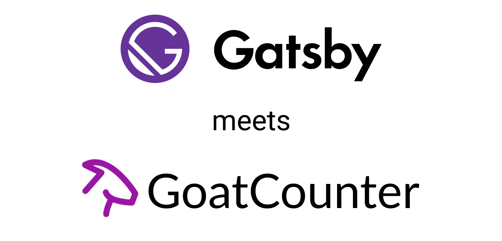

# gatsby-plugin-goatcounter

Adds GDPR compliant [GoatCounter Statistics](https://goatcounter.com/) to your GatsbyJS website.

## v.0.2.0
- BREAKING CHANGE: drops `goatcount` in favor of `useGoatCounter` hook
- not tagged as beta yet it's still not widely tested
- I'd appreciate bug reports & feature requests. 🙏

I plan to add a component to track outbound links like [gatsby-plugin-google-analytics](https://github.com/gatsbyjs/gatsby/tree/master/packages/gatsby-plugin-google-analytics#outboundlink-component)

For now [count.js](https://gc.zgo.at/count.js) (GoatCounter's minimalistic js file) is loaded once from the official CDN.  
Eventually it'll be bundled and inlined, want to talk to GoatCounter for this first tho.

## Install

```bash
yarn add -D gatsby-plugin-goatcounter
# or
npm i -D gatsby-plugin-goatcounter
```

> It has `peerDependencies` on [react](http://npmjs.com/package/react) & [gatsby](https://www.npmjs.com/package/gatsby) which are required by Gatsby anyways 😉

### How to use

```js
// In your gatsby-config.js
module.exports = {
  plugins: [
    {
      resolve: `gatsby-plugin-goatcounter`,
      options: {
        // REQUIRED! https://[my_code].goatcounter.com
        code: 'YOUR_GOATCOUNTER_PAGE_CODE';
        
        // ALL following settings are OPTIONAL

        // Avoids sending pageview hits from custom paths
        exclude: [];
        // Delays sending pageview hits on route update (in milliseconds)
        pageTransitionDelay: 0,
        // Defines where to place the tracking script - boolean `true` in the head and `false` in the body
        head: false,
        // set to true to include a gif to count non-JS users
        pixel: false,
        // Allow requests from local addresses (localhost, 192.168.0.0, etc.) for testing the integration locally.
        // TIP: set up a `Additional Site` in your GoatCounter settings and use its code conditionally when you `allowLocal`, example below
        allowLocal: false,
        // override the default localStorage key more below
        localStorageKey: 'skipgc',
      },
    },
  ],
}
```

### Tip: Additional Site to not spam your main analytics for testing purposes

```js
// In your gatsby-config.js
// just an example, you can have your own logic how you decide what's production and what not.
const isProduction = process.env.NODE_ENV === 'production'
module.exports = {
  plugins: [
    {
      resolve:`gatsby-plugin-goatcounter`,
      options: {
        code: isProduction ? 'YOUR_GOATCOUNTER_PAGE_CODE' : 'GOATCOUNTER_DEV_CODE';
        allowLocal: !isProduction
      },
    },
  ],
}
```

This way you can test locally without spamming your statistics 😉

### manual counting

You can `useGoatCounter` to manually track events

```js
import { useGoatCounter } from 'gatsby-plugin-goatcounter'

const Layout = (props) => {
  const count = useGoatCounter()

  count({
    path: 'event-name',
    event: true,
  })

  count({
    path: 'event-name',
    title: 'Event Name',
    referrer: 'example.com',
    event: true,
  })

  return <h1>GaiAma.org is saving as much rainforest as possible</h1>
}
```

> `useGoatCounter` returns a noop function, meaning a no-operation function which does nothing, until GoatCounter.js has loaded. The component will then re-render and send the event.

### Skip own views
`gatsby-plugin-goatcounter` skips views if the `localStorageKey` by default `skipgc` has been set in localStorage.  
You have to visit you-url.com/#skipgc (or you defined localStorageKey) once or set it manually to 't'.  
Why 't'? I basically copied the example from GoatCounter settings. Naming things is hard 😅

## Questions? Anything unclear?
Feel free to open an [issue](https://github.com/GaiAma/Coding4GaiAma/issues/new).

## Who uses gatsby-plugin-goatcounter?
- [Coding4.Gaiama.org](https://coding4.gaiama.org)

## License

[MIT](/license) © [CanRau](https://www.canrau.com/)